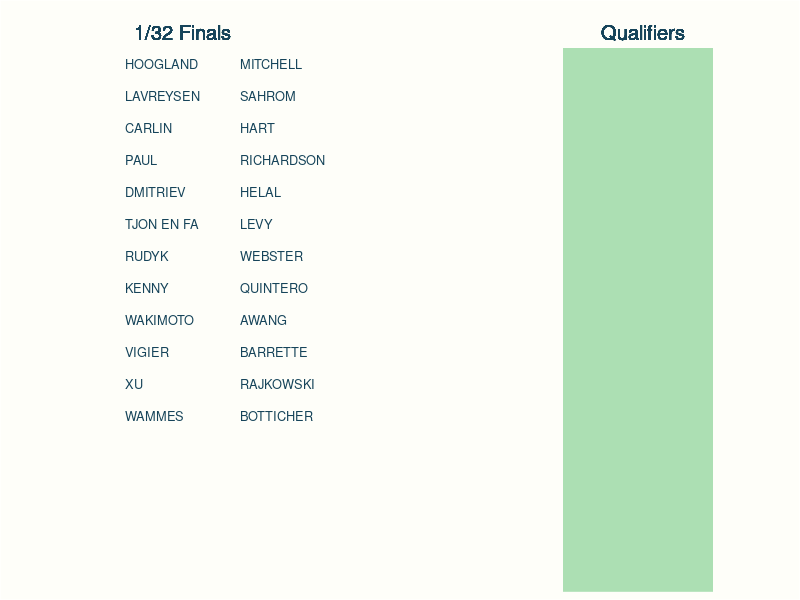

```{r setup, include=FALSE}
knitr::opts_chunk$set(echo = TRUE, warning = FALSE, message = FALSE, code_folding = TRUE)
options(kableExtra.html.bsTable = T)

library(tidyverse)
library(lubridate)
library(infreqthemes)
library(xaringanExtra)
library(knitr)
library(kableExtra)
library(fst)
library(formattable)

xaringanExtra::use_panelset()

remote_project_path <- '~/Documents/R Projects/track-cycling/'
remote_targets_path <- paste0(remote_project_path, '_targets/objects/')

read_remote_target <- function(name, path = remote_targets_path){
  
  file_path <- paste0(path,name)
  
  tar <- try(read_rds(file_path),silent=TRUE)
  
  if(class(tar) != 'try-error'){return(tar)}
  
  tar <- try(read_fst(file_path),silent=TRUE)
  
  if(class(tar) != 'try-error'){return(tar)}
  else{stop("Failed to read remote target")}
}

source(paste0(remote_project_path, 'R/functions/forecasting.R'))
source(paste0(remote_project_path, 'R/functions/betting.R'))
```

<details>
<summary>*This is the third post in a series: Click for links.*</summary>

[*Tokyo 2020 Betting I: Predictive Models for Pairwise Matches*](https://www.infreq.com/posts/2021-07-23-tokyo-2020-i/) 

[*Tokyo 2020 Betting II: Model Refinement and Feature Engineering*](https://www.infreq.com/posts/2021-07-28-tokyo-2020-ii/)

[*Tokyo 2020 Betting III: From Matches to Medals... and Bookies*](https://www.infreq.com/posts/2021-08-03-tokyo-2020-stakes-holding/) **(This Post)**
</details>

*Due to a lag in drafting vs analysis time, this post was originally published with betting stakes only. I have retrospectively added the detail of how these stakes were derived.*

So far in this series I've focused on predicting the outcome of single matches between two athletes, and derived a bespoke Bradley-Terry model for this purpose.

To construct a betting strategy I will need to turn the probability that a given rider wins a single match, into the probability that they will win the whole tournament - and hence the gold medal.

In the first section of this post I introduce the tournament format for the Tokyo 2020 Individual Sprint, and how the outputs of the Bradley-Terry model are used to derive a distribution for the gold medal winner.

In the second part I will introduce the Kelly Criterion, and derive generalisations that allow for multiple outcome bets, handling posterior uncertainty, and accounting for additional caution.

At the end of the post I've included the log of the bets that I ended up placing, that were originally published in a holding post whilst the event was running.

### Assumptions
This post makes some assumptions about you!

I'll assume you've read the previous posts in the series, though this post should work as a standalone.

I'll also assume you have some knowledge of basic betting terminology (fractional odds, stakes). To derive my betting strategy I will use some discrete probability, and formalise a non-linear optimisation model.

If you're interested in reading the underlying code, this is in R..

<aside>The full model code, from model fitting to betting stakes is [here](https://github.com/odaniel1/track-cycling/tree/targets).</aside>

## Tournament Forecasting

The Individual Sprint has a complex tournament structure, which will see the winning athlete compete between 10 and 16 sprints before they can claim the medal!

There are four main parts to the tournament, which in Tokyo 2020 will see 30 athletes compete:

::::: {.panelset}

::: {.panel}
[Overview]{.panel-name}


* A *qualifying* round that sees all athletes competing individually to set the fastest time, with the six slowest athletes eliminated.

* *1/32, 1/16* and *1/8 Finals* that see the athletes compete in pairs to win a single sprint. The winner automatically qualifies for the next round (eg. 1/32 Finals winners qualify for 1/16 Finals).

* *Repechage* races that see the losers from the previous round competing to take take any remaining places in the next round (eg. losers of 1/32 Finals compete for four remaining places in the 1/16 Finals).

* *Quarter-, Semi-, and Finals* raced between pairs of riders. At this stage each match is  contested in a best of three sprints format.
:::

:::{.panel}
[Tokyo 2020 Summary]{.panel-name}

| Round | Athletes Competing | Matches x Athletes per Match | Sprints per Match | Athletes Qualifying |
|---|:-:|:-:|:-:|:-:|
| Qualifying | 30 | 30 x 1 | 1 |24  |
| 1/32 Finals | 24 | 12 x 2 | 1 | 12 |
| *Repechage 1* | 12 | 4 x 3 | 1 | 4 |
| 1/16 Finals | 16 | 8 x 2 | 1 | 8 |
| *Repechage 2* | 8 | 4 x 2 | 1 | 4 |
| 1/8 Finals | 12 | 6 x 2 | 1 | 6 |
| *Repechage 3* | 6 | 2 x 3 | 1 | 2 |
| Quarterfinals | 8 | 4 x 2 | Best of 3 | 4 |
| Semifinals | 4 | 2 x 2 |  Best of 3 | 2 |
| Finals | 2 | 2 x 1 |  Best of 3 | 1 |
:::

:::{.panel}
[Tokyo 2020 Detail]{.panel-name}
The tables below provide the detail that determines which riders face each other in each round; its adapted from the table published by the UCI in their [Track Regulations](https://www.uci.org/docs/default-source/rules-and-regulations/3-pis-20210610-e.pdf).

The initial rider codes N1-N24 are in order of the time posted in the qualifying round: N1 is the fastest qualifier, N24 the slowest.

```{r, results = 'asis', echo = FALSE}
olympic_rounds <- read_remote_target("fcst_rounds_Men")

round_names <- unique(olympic_rounds$round)

for(r in round_names){
  
  t <- olympic_rounds %>%
    filter(round == r)  %>%
    select(-round_no,-competitors) %>%
    kable("pipe") %>%
    kable_styling(full_width = FALSE, bootstrap_options = list(condensed = TRUE), font_size = 7)

  cat(sprintf("<details><summary>**%s**</summary>", r))
  print(t)
  cat("</details>")
}
```

:::
:::::

To forecast the gold medal winner I will simulate results for each match in the tournament, using the detailed tournament structure tables above.

In short, simulating the tournament will involve:

* Using the rider qualifying times to pair riders based on the details in the 1/32 Finals table (in the Tokyo 2020 Detail tab above).

* Sample the winner/loser of each match using the Bernoulli distribution that is implied by the Bradley-Terry model (recapped below). Assign each rider the appropriate winner/loser code, from the detailed table.

* Repeat the above for each of the successive rounds, until the Gold medal winner is decided.

That sounds simple enough, but there are a few things for us to unpack here.

### Sampling a Single Match (Recap of the Bradley-Terry model)

The Bradley-Terry model assumes that in a match between athletes $r$ and $s$ then

$$\mathbf P[r \text{ beats } s] = \frac{\beta_r}{\beta_r + \beta_s}.$$

Given a set of parameters $(\beta_r)$ I can use the formula above to sample the winner of any given match, as required in step two above.

The previous posts have focused on estimating the parameters $\beta_r$, with the final model taking the form $\beta_r = \exp \left( \alpha_r^{(m)} + \kappa t_r \right)$, where

* $\alpha_r^{(m)}$ is the estimated athlete strength going into the match, $m$, taking into account time varying effects and a home advantage (in the case of Tokyo only affecting the two Japanese competitors).

* $t_r$ is the athlete's qualifying time in the current competition, and along with the estimated coefficient $\kappa$ this allows us to take into account the athlete's current form.


### Sampling a Tournament

Sampling a tournament is just a case of sampling match outcomes, and then using the detailed tournament information in the tabs above to identify who to pair in the next round of matches. The animation below gives an example of this dynamic.

```{r tournament-animation, echo=FALSE, layout='l-body', preview = TRUE}

```

There are two nuances that require minor tweaks. The first is that some of the repechage races, are contested by three athletes not two. This has a simple resolution as the Bradley-Terry model can be extended to consider matches between three (or more) athletes as follows

$$
\begin{align}
\mathbf P[r \text{ beats } s \text{ and } q\,] = \frac{\beta_r}{\beta_r + \beta_s + \beta_q}.
\end{align}
$$

The second is that from the quarterfinals onward, matches are contested in a best-of-three format, and this changes the probability of winning. This was covered in detail in the [previous post](https://www.infreq.com/posts/2021-07-28-tokyo-2020-ii/#the-match-likelihood) so I won't recap here.

### Monte-Carlo Uncertainty

Tournament results derived using the simulation *algorithm* set out above will have uncertainty since I am sampling the winner of each match from a probability distribution.

To account for this, I won't just sample a tournament once - I'll repeat the tournament multiple times (independently) from which I can say not only the most likely winner of the Gold medal, but also the probability that they will win: this probability will be key for informing when to bet.

<aside>This is a simple example of a [*Monte Carlo* algorithm](https://en.wikipedia.org/wiki/Monte_Carlo_method).</aside>

Running the simulation 1000 times on the same set of parameters as were used above, we can report the frequency with which each rider wins the gold medal.

```{r}
olympic_rounds <- read_remote_target('fcst_rounds_Men')
strength_draw <- read_remote_target('fcst_strength_draws_Men') %>% filter(.draw == 1)

# set time to 0, assuming that the qualifying times are not yet observed
strength_draw <- strength_draw %>% mutate(time = 0)

set.seed(14142)
gold_samples <- forecast_tournament(strength_draw, olympic_rounds, samples = 5000, accumulate = FALSE, gold_only = TRUE)

gold_probs <- gold_samples %>%
  count(rider, sort = TRUE) %>%
  mutate(p = percent(n/sum(n),digits=0)) %>%
  filter(p > 0.005)
  
gold_probs %>%
  kable("pipe", col.names = c('Athlete', 'Gold Frequency', 'Gold %')) %>%
  kable_styling(bootstrap_options = "condensed", full_width = FALSE, position = "center", font_size = 14)
```

Under the assumption that the model is correct and we've learnt the exact true parameter values, then the percentage figures can be interpreted as the probability that the athlete will win the gold medal.

### Bayesian Uncertainty

In reality my model is just that - a model, so it won't exactly capture reality, and further the parameters are estimates based on historic data: so in addition to the uncertainty implied by the model (the Monte Carlo uncertainty, above), I have reason to be uncertain about the model itself.

This uncertainty in the model is captured by the Bayesian posterior distribution of the model parameters. Since I fit the model in Stan, I have samples from the posterior distribution so I can propagate my uncertainty about the model parameters to uncertainty about the gold medal probabilities by running tournament simulations against each draw from the posterior distribution.

The examples below show the gold medal distributions for the top three athletes going into the Tokyo 2020 Olympics, with the vertical lines denoting the posterior mean.

```{r}
bayes_gold_probs <- read_remote_target("fcst_gold_probs_Men")

most_probable <-  bayes_gold_probs %>%
  group_by(rider) %>%
  summarise(
    mean_gold_prob = mean(gold_prob)
  ) %>%
  ungroup() %>%
  mutate(rank = rank(-mean_gold_prob))

bayes_gold_probs <- bayes_gold_probs %>%
  left_join(most_probable) %>%
  mutate(rider = fct_reorder(rider, rank))

ggplot(bayes_gold_probs %>% filter(rank <= 3)) +
  geom_histogram(aes(gold_prob), binwidth = 0.1, color = infreq_palette["beige"]) +
  geom_vline(data = most_probable %>% filter(rank <= 3), aes(xintercept = mean_gold_prob), color = infreq_palette["darkblue"], linetype = "dashed") +
  scale_x_continuous(breaks = c(0, 0.5, 1), labels = scales::percent_format(accuracy=1)) +
  facet_wrap(vars(rider), strip.position = "bottom") +
  theme(
    axis.title = element_blank(),
    axis.line = element_blank(),
    axis.ticks = element_blank(),
    axis.text.y = element_blank(),
    strip.text=element_text(size = 12, color = infreq_palette["darkblue"]),
    strip.background = element_rect(color=infreq_palette["beige"], fill=infreq_palette["beige"]),
    strip.placement = "outside"
  )
```

<aside>Posterior gold medal probabilities, based on a model run prior to qualifying - so all athletes were given the same qualifying time.</aside>

The distributions above are a good reminder that uncertainty in the real world isn't all about normal distributions; in particular their bimodal nature indicates that an analysis based on a single point estimate for each athlete is bound to gloss over this structural nuance - further justifying the need to account for uncertainty in the modelling.

This is one of the main benefits of fitting a Bayesian model - If my Bradley-Terry model was in the frequentist framework, I would have single parameter estimates for the athlete strenghts and confidence intervals for those values. Unlike Bayesian posteriors, frequentist confidence intervals don't imply distributions, so it isn't possible to sample from them. Ultimately this means its not clear how to derive uncertainty intervals for the gold medal probability.

<aside>Short of writing a likelihood that encapsulates both the Bradley-Terry model and the tournament dynamic - but that is daunting, if doable at all.</aside>

This ability to propagate the uncertainty from the original Bradley-Terry model, to downstream calculations is one of [my motivations](https://www.infreq.com/about.html#why-infrequently-frequentist) for preferring Bayesian models over their frequentist equivalents: 


## Deriving the Betting Strategy

With predictions for the likely winners, its time to think about how best to use these predictions to inform a betting strategy.

The simple strategy would be to place bets on the athletes who you believe are most likely to win, but this is sub-optimal for a number of reasons:

* This strategy does not inform us of how much to bet, only who to bet on.

* Depending on the odds offered by the bookies, the risk may not be worth the return: i.e. if I forecast that Lavreyson has a probability 0.9 of winning, but the bookies are offering odds of 1/9, then the expected return on a £1 bet is £0.90, so I can expect to lose money.

<aside> Fractional odds of $a/b$ mean that a winning bet of 1 unit will receive back $1 + a/b$, the original stake plus the fractional odds.</aside>

* From the histograms above we can see that the most likely winner varies across our posterior uncertainty - so I'd at least need to define a way to identify this person across all draws.

Fortunately there's pre-existing literature on betting strategies that I can draw on for my application, namely I'll consider a variant of the classic Kelly Criterion.

### Betting Strategy for Single Bets

To set-up the theory, I'll consider a simplified scenario with just two outcomes.

Suppose I'm offered odds $O$ to play a game for which I know ahead of time that the probability of winning is $p$. If I have a starting budget $W^{(0)}$ that I'm willing to invest in gambling, then what fraction $f$ of this should I be willing to bet?

If I'm only ever going to place a single bet, intuition would suggest that I should either bet my entire budget, $f = 1$, (if I think the odds are favourable), or I should refrain from betting entirely, $f = 0$.

This aligns to the strategy in which my aim is to maximise my expected return. To see this, my expected wealth after betting $0 \leq f \leq 1$ of my budget is

$$
\begin{align}
\mathbf E \left[ W^{(1)} \right ] & = \underbrace{(1-p) \times (1-f)W^{(0)}}_{\text{I lose the bet}} + \underbrace{p \times (W^{(0)} + fW^{(0)}O)}_{\text{I win}} \\
\\
& = (1-f)W^{(0)} + fW^{(0)}p(1+O)
\end{align}
$$

Since the formula is linear in $f$ the maximum will be achieved at one of $f = 0$ (if the derivative, in $f$, of the expression above is negative) or $f = 1$ (if its positive). Calculating the derivative we find that the strategy that maximises expected wealth is:

$$\text{If $p > (1+O)^{-1}$ bet the full budget ($f = 1$), otherwise do not bet ($f = 0$).}$$

Now suppose however that I intend to place more than one bet, and moreover that I'm willing to reinvest my previous winnings into future bets: is it still wise that so long as the odds are favourable, I should bet my entire budget each time?

Proceeding as above, one can show that the expected wealth after playing $n$ games (or until I go bust, whichever happens first) is still maximised by betting my full budget, including reinvestment, and this has an expected return of

$$\mathbf E \big[ W^{(n)} \big] = \left\{pW^{(0)}(1+O)\right\}^n.$$

Since this tends to infinity with $n$, it would suggest that not only should I bet my entire budget each time I win, but I should be willing to keep playing for arbitrarily long.

But that strategy is absurd: eventually I am guaranteed to lose one of the bets, losing my entire accrued budget, and I won't be able to bet anymore.

<aside> This is similar to the [St. Petersburg paradox](https://en.wikipedia.org/wiki/St._Petersburg_paradox).</aside>


This is demonstrated in the example below where I've simulated the outcome of 1,000 independent gamblers with a starting budget $W^{(0)} = 1$, using this strategy to play a game with probability $p = 2/3$ of winning, offered at odds of 2 - 1, $O = 2$, (so that the expected return from a single game is 2). For the simulation I've run to a maximum of 20 games.

```{r}
set.seed(1414214)

# samples the outcome of betting on a single game, and returns the winnings
# based on using the strategy that maximises expected wealth.
r_game_max_exp_wealth <- function(B, p, O){
  
  # if no wealth, don't bet
  if(B == 0){return(0)}
  
  # don't bet if the odds are not in favour
  if(p < (1+O)^{-1}){ return(B)}
  
  # otherwise bet all of the budget
  outcome <- rbinom(1, size = 1, prob = p)
  
  wealth <- B * (1+O) * outcome

  return(wealth)
}

# samples a sequence of n identical games assuming returns are reinvested into 
# the budget, and that the strategy is to maximise expected wealth
r_seq_games_max_exp_wealth <- function(n, B, p, O){
  rep(O,n) %>% accumulate(.f = function(B,O){r_game_max_exp_wealth(B,p,O)}, .init = 1)  
}

# multiple draws for a gambler who plays the game 20 times, withan initial budget of 1
# probability of winning 2/3 and odds of 2-1.
game_samples <- tibble(sample = 1:1000) %>%
  rowwise() %>%
  mutate(run = map(sample, ~tibble(game = 0:20, budget = r_seq_games_max_exp_wealth(20,1,2/3,2)))) %>%
  unnest(run)

# for plotting, add zeros so that vertical lines show where the budget goes to zero.
add_zeros <- game_samples %>%
  filter(budget == 0) %>%
  group_by(sample) %>%
  slice(which.min(game)) %>%
  mutate(game = game - 1) %>%
  ungroup()

game_samples <- bind_rows(game_samples, add_zeros)  

# plot game outcomes
p_max_exp_wealth <- ggplot(game_samples) + geom_line(aes(game, log10(budget), group = sample), alpha = 0.05) +
  scale_y_continuous(breaks = seq(0,9,by=3), labels = scales::math_format(10^.x)) +
  xlab("Game") + ylab("Expected Wealth")

p_max_exp_wealth
```

Of the 1,000 gamblers sampled, `r game_samples %>% filter(game == 20) %>% filter(budget > 0) %>% nrow` made it to the 20th game without going bust.

The message to take away is that maximising expected wealth is not a sensible strategy for repeated betting with reinvestment.

### The Kelly Criterion (for Binary Outcomes)

The optimal strategy for the scenario of repeated bets with reinvestment was identified by John Kelly in 1956; the [original paper](https://www.princeton.edu/~wbialek/rome/refs/kelly_56.pdf) is relatively accessible reading.

Kelly's observation is that rather than trying to maximise expected wealth, we should aim to maximise the growth rate of wealth. Typically average growth rate is defined by the geometric mean:

$$\left( \frac{W^{(1)}}{W^{(0)}} \frac{W^{(2)}}{W^{(1)}} \cdots \frac{W^{(n)}}{W^{(n-1)}} \right)^{\frac1n} = \left(\frac{W^{(n)}}{W^{(0)}}\right)^{\frac1n}$$
This in turn can be simplified by noting that the maximum of this expression will be achieved by the same value $f$ as maximising the logarithm

$$ \log \left(\frac{W^{(n)}}{W^{(0)}}\right)^{\frac1n} = \frac1n \log W^{(n)} - \frac1nW^{(0)},$$
and further we can drop the last term and the multiplication by $\frac1n$ as they're both constant. So that means that the strategy $f$ that maximises expected growth rate is the same as the strategy that maximises log wealth.

The formula for log wealth after a single game is
$$
\begin{align}
\mathbf E \left[ \log W^{(1)} \right] &= (1-p) \log\left((1-f)W^{(0)}\right) + p \log\left( W^{(0)} + fW^{(0)}O\right)  \\
& = \log\left(W^{(0)}\right) + (1-p)\log\left(1-f\right) + p\log\left(1 + fO\right)
\end{align}
$$

The plot below shows how expected log wealth varies as we change the fraction of wealth invested, $f$, assuming the same parameter values in the simulation above: $W^{(0)} = 1,\, p = 2/3, \, O = 2$. 

```{r}
ggplot(tibble(f=c(0,0.99), y = c(-1,1)), aes(f,y)) +
  stat_function(aes(f), fun = function(f) 1/3 *log(1-f) + 2/3 * log(1 + 2*f), color = infreq_palette["darkblue"]) +
  # maximum achieved at f = 1/2
  geom_segment(x = 0.5, xend = 0.5, y = -1, yend= 1/3 *log(1/2) + 2/3 * log(2), color = infreq_palette["orange"], linetype = "dashed") +
  xlab("Fraction of Wealth Gambled") + ylab("Expected Log Wealth")
```

For this particular set of parameters the maximum is achieved at $f = \frac12$, so the Kelly bet would be to always bet half of your current budget in the next round. More generally, the equation above can be solved by hand, and the optimal bet is given by 

<aside>Using the standard method of solving for zeros of the derivative.</aside>

$$f^* = p - O^{-1}(1-p).$$

The below overlays the outcome of a further 1,000 gamblers playing the same game as before, but adopting the Kelly Criterion.

```{r}
set.seed(1414214)

# samples the outcome of betting on a single game, and returns the winnings
# based on using the strategy that maximises expected log wealth (Kelly bet).
r_game_max_log_wealth <- function(B, p, O){
  
  # if no wealth, don't bet
  if(B == 0){return(0)}
  
  # outcome of the game (1 = win, 0 = lose)
  outcome <- rbinom(1, size = 1, prob = p)
  
  kelly_bet <- B * (p -(1-p)/O)
  
  wealth <- if_else(outcome == 0, B - kelly_bet, B + kelly_bet * O)

  return(wealth)
}

# samples a sequence of n identical games assuming returns are reinvested into 
# the budget, and that the strategy is to maximise expected wealth
r_seq_games_max_log_wealth <- function(n, B, p, O){
  rep(O,n) %>% accumulate(.f = function(B,O){r_game_max_log_wealth(B,p,O)}, .init = 1)  
}

# multiple draws for a gambler who plays the game 20 times, withan initial budget of 1
# probability of winning 2/3 and odds of 2-1.
game_kelly_samples <- tibble(sample = 1:1000) %>%
  rowwise() %>%
  mutate(run = map(sample, ~tibble(game = 0:20, budget = r_seq_games_max_log_wealth(20,1,2/3,2)))) %>%
  unnest(run)


# plot game outcomes
p_kelly <- p_max_exp_wealth +
  geom_line(data = game_kelly_samples, aes(game, log10(budget), group = sample), alpha = 0.025, color = infreq_palette["darkblue"])

p_kelly
```

We previously saw that `r game_samples %>% filter(game == 20) %>% filter(budget > 0) %>% nrow` of the gamblers maximising expected wealth had any money at the end of 20 games, whereas `r game_kelly_samples %>% filter(game == 20) %>% filter(budget > 1) %>% nrow` of the 1,000 gamblers employing the Kelly strategy had increased their budget by the end of 20 games.

Kelly's result is that using this strategy is guaranteed in the limit (i.e. if you were to have infinitely many opportunities to play the game) to lead to higher wealth than any other betting strategy.

Its worth noting of course that there are two major assumptions in the theoretical model that won't hold in the real world: 

* the gambler is given the opportunity to play the game infinitely often: nobody has that much time on the planet, let alone time to play games,

* the gambler knows the true probability of winning the game.

Whilst the theoretical Kelly strategy optimises risk and reward - the limitations above mean that in the real world it is actually more aggressive than is perhaps appropriate. A common way to bet with more caution is to use a *fractional Kelly strategy*: betting say half the proposed Kelly strategy.

I'll look at a Bayesian way to introduce caution at the end of the post.

### Allowing for Spread Betting

I'll now turn to the specifics of implementing the Kelly Strategy for my Olympic betting: first looking at how to generalise the criteria for games with more than two outcomes

The bets I'm looking to place are on the Gold medal winner for each of the men's and women's Individual Sprints; so for now that's a total of two games, far from the infinite number underpinning the theory, but if all goes well that's not to say I won't bet on the World Championships in October!

For now I'll consider a single one of the two events, let's say the Men's, and suppose that I have a fixed set of probabilities that describe the likelihood of each rider winning: $(p_r)_{r = 1}^R$.

<aside>How to account for the Bayesian uncertainty is the content of the next section.</aside>

Extending the notation from before, I'll suppose I've found a bookmaker (or even a number of independent bookmakers) willing to offer odds $O_r$ on rider $r$. Given a starting budget $W^{(0)}$, what fraction $f_r$ of this should I invest in rider $r$?

Applying the heuristic of Kelly's criterion, I'll aim to maximise my log wealth, which after a single game in the multi-outcome scenario is given by:

$$
\begin{align}
\mathbf E \left[ \log W^{(1)} \right] & = \sum_{r = 1}^R \, p_r \, \times \, \log \bigg(\underbrace{W^{(0)}(1-F)}_{\text{Not gambled}} + \underbrace{ W^{(0)}f_rO_r}_{\text{r wins}}\bigg) \\
\\
&=  \log W^{(0)} + \sum_{r = 1}^R  p_r \log(1 - F + f_rO_r)
\end{align}
$$

where $F = \sum_r f_r$ is the total fraction of wealth invested across all athletes.

The spread-bet Kelly criterion will therefore look to find the fractions $(f_r)_{r=1}^R$ that maximise this expression, subject to the constraints that the fractions must be positive (I can't bet a negative proportion of my wealth) and must sum to less than $1$ (I cannot exceed my budget).

That is we have the following non-linear constrained optimisation problem:

$$
\begin{aligned}
& \text{maximize}
& &  \textstyle{\sum_{r=1}^R} p_r \log (1 - F + f_rO_r) \\
& \text{subject to}
& &   f_r \geq 0,  \,\qquad 1 \leq r \leq R \\
& & & \textstyle{\sum_{r=1}^R} f_r = F \leq 1 
\end{aligned}
$$

Rather than trying to solve this analytically I'll us computational solvers; in this instance I'll use the [NLopt](https://nlopt.readthedocs.io/en/latest/) package of solvers through the R library [`nloptr`](https://cran.r-project.org/web/packages/nloptr/index.html).

NLopt is a powerful package, with a range of different optimisation algorithms; I opted for the [COBYLA](https://nlopt.readthedocs.io/en/latest/NLopt_Algorithms/#cobyla-constrained-optimization-by-linear-approximations) (Constrained Optimisation by Linear Approximations) algorithm, which benefits from not requiring the user to derive and supply the gradient of the function to be optimised.

The code below provides a minimal example showing how to set-up NLopt to run the COBYLA algorithm for the simple two-outcome Kelly strategy described in the previous section.

<details>
<summary>nloptR: Minimal Example</summary>
I'll find the solution to the original Kelly Criterion, based on the example game discussed in previous sections. The aim is to solve:

$$
\begin{aligned}
& \text{maximize}
& &  \frac13 \log(1-f) + \frac23 \log(1 + 2f) \\
& \text{subject to}
& &   0 \leq f \leq 1
\end{aligned}
$$
We already saw that this can be solved by hand, and that the maximum is achieved at $f^* = \frac12$.

The code below provides a computational approximation to the solution: 
```{r, echo = TRUE, code_folding = FALSE}
library(nloptr)

# expected logarithm of wealth after one round of the game described above.
expected_log_wealth <- function(f){ 1/3 * log(1-f) + 2/3 * log(1 + 2*f)}

# nloptr is configured to always find minima; so we will need to use the
# negative of the above (the minima of this coincides with the maxima of
# the original function).
neg_expected_log_wealth <- function(f){ -1 * expected_log_wealth(f)}

solve <- nloptr(
  # guess of the value f at which the maximum might be achieved; for
  # demonstration purposes deliberately avoiding 0.5.
  x0 = 0.1,
  
  # the function to minimise
  eval_f = neg_expected_log_wealth,
  
  # lower/upper bound constraint on f
  lb = 0,
  ub = 1,
  
  opts = list(
    # the algorithm to use; I'm using COBYLA.
    "algorithm"="NLOPT_LN_COBYLA",
    
    # the tolerance at which the algorithm will decide it has converged
    "xtol_rel"=1.0e-4,
    
    # the maximum number of iterations to try before stopping
    "maxeval"=1e5
  )
) 

print(solve)
```

Looking at the output above, the algorithm ran for a total of `solve[["iterations"]]` before converging to a solution within the provided tolerance; moreover it estimates $f^* \approx `r solve[["solution"]]`$, which is a good approximation to the true solution.

</details>

Returning to the cycling model, we're now in a position to optimise a betting strategy based on a fixed point estimate of the winning probabilities. For this I'll use the posterior mean winning probabilities returned from the Bayesian model run with historic data, and prior to the qualifying round at Tokyo 2020. I'm using the means as unlike the posterior mode (MAP) or median, these have the property that summing over the means of all riders returns 1, so they define a proper probability distribution.

Odds were available at Unibet.com, and for this analysis I'm using the odds offered on 3rd August 2020 - the day before the qualifying round for the Men's event.

The plot below shows my point estimates of the athlete's winning probabilities, against the odds on offer; the curve denotes the boundary at which betting on the rider is expected to have a positive return, and our intuition would say that any betting strategy should avoid placing money on athletes who are below this line.

```{r}
odds <- read_csv("../../../track-cycling/data/202021_2020-TOKYO-OLYMPICS_Odds.csv") %>%
  filter(odds_date == ymd(20210803), gender == 'Men') %>%
  select(rider, fractional_odds) %>%
  mutate(
    odds = 1 + fractional_odds,
    # the probability the bookies imply they believe
    implied_probability = 1/odds,
    # account for the fact that they run a 'Dutch Book'
    normalised_implied_probability = implied_probability / sum(implied_probability)
  )

odds <- odds %>% left_join(most_probable) %>%
  mutate(
    annotation = if_else(
      mean_gold_prob > odds^(-1),
      # rider %in% c("LAVREYSEN HARRIE", "GLAETZER MATTHEW"),
      str_extract(rider, "^([^ ])+"), ""),
  )

ggplot(odds) +
  geom_point(aes(mean_gold_prob, fractional_odds), size =2) +
  geom_text(aes(mean_gold_prob, fractional_odds, label = annotation), hjust =-0.2, color = infreq_palette["darkblue"]) +
  stat_function(data = tibble(p = c(0.05,1)), aes(p), fun = function(p) 1/p -1, color = infreq_palette["darkblue"], linetype = "dashed") +
  scale_x_continuous(breaks = seq(0,1,by = 0.2)) +
  coord_cartesian(xlim = c(0,1)) +
  xlab("Posterior Mean Gold Probability") +
  ylab("Odds Offered")
```

Solving the optimisation problem for these inputs results in the following proposed bets:

<aside>The full code for optimising the multi-outcome bet is available on [GitHub](https://github.com/odaniel1/track-cycling/blob/master/R/functions/betting.R).</aside>


```{r,message= FALSE, warning = FALSE,results='hide'}
# summarise point estimate (mean posterior probability) winning probabilities
point_estimate_probs <- most_probable %>%
  transmute(.draw = 1, rider, gold_prob = mean_gold_prob)

# solve the multi-outcome spread-bet Kelly strategy; note since only a single draw
# is provided using the optimise_kelly_bayes function does optimisation without
# uncertainty (eg. ignore the Bayes bit)
point_estimate_strategy <- optimise_kelly_bayes(odds, point_estimate_probs)

point_estimate_strategy <- point_estimate_strategy %>%
  mutate(kelly_stakes = round(kelly_stakes, 2)) %>%
  select(rider, fractional_odds, mean_gold_prob, kelly_stakes)
```

```{r, echo = FALSE}
point_estimate_strategy %>%
  filter(kelly_stakes > 0) %>%
  select(
    `Athlete` = rider, `Odds` = fractional_odds,
    `Modelled Gold Prob.` = mean_gold_prob, `Stake` = kelly_stakes
  ) %>%
  kable("pipe", digits = 2)
```

<details>
<summary>All Other Odds</summary>
```{r, echo = FALSE}
point_estimate_strategy %>%
  filter(kelly_stakes == 0) %>%
  arrange(fractional_odds) %>%
  select(
    `Athlete` = rider, `Odds` = fractional_odds,
    `Modelled Gold Prob.` = mean_gold_prob, `Stake` = kelly_stakes
  ) %>%
  kable("pipe", digits = 2)
```
</details>

Overall the strategy suggests I should bet on just `r point_estimate_strategy %>% filter(kelly_stakes > 0) %>% nrow` of the athletes, and invest `r percent(sum(point_estimate_strategy$kelly_stakes),0)` of my total budget.

Interestingly the solution is proposing that I should bet on Harrie Lavreysen, even though the plot above indicates that this bet is expected to lose money. My intuition here is that perhaps this is to offset the riskier bet on Matthew Glaetzer - though I haven't fully worked through this yet.

<aside>My alternative intuition is that I have a bug in my code, or the solver hit its tolerance.</aside>

### Accounting for Bayesian Uncertainty

Earlier in the post we saw that the point estimates for each athlete's probability of winning are a somewhat unsatisfactory summary of the underlying distributions which are bi-model.

The plot below replicates the above - but replacing the single point estimate with all the draws from the posterior. For clarity I'm only showing the four riders with the highest posterior mean.


```{r}
bayes_gold_probs <- bayes_gold_probs %>% left_join(odds) %>%
  mutate(annotate = str_extract(rider, "^([^ ])+"))

top_4 <- bayes_gold_probs %>% filter(rank <= 4)

ggplot(top_4) + 
  # decision boundary
  stat_function(
    data = tibble(p = c(0.05,1)), aes(p),
    fun = function(p) 1/p -1, color = infreq_palette["darkblue"], linetype = "dashed"
  ) +
  # posterior draws
  geom_point(aes(x=gold_prob, y= fractional_odds), alpha = 0.2) +
  # posterior mean
  geom_point(
    data = distinct(top_4, rider, fractional_odds, mean_gold_prob),
    aes(x = mean_gold_prob, y= fractional_odds), size = 5,
    color = infreq_palette["darkblue"],
    fill=infreq_palette["orange"],pch=21
  ) +
  # rider annotation
  geom_text(
    data = distinct(top_4, rider, fractional_odds, annotate),
    aes(x = 1, y= fractional_odds, label = annotate),
    vjust=-0.5,hjust=1,color = infreq_palette["darkblue"]
  ) +
  scale_x_continuous(breaks = seq(0,1,by = 0.2)) +
  coord_cartesian(xlim = c(0,1), ylim = c(0,25)) +
  xlab("Posterior Gold Probability") +
  ylab("Odds Offered")
```

<aside>The data displayed is the same as in the posterior histograms shown previously.</aside> 

All four riders have a non-negligible proportion of their density above the break-even boundary, suggesting that we should be open to considering bets on any of them.

We can calculate the expected log wealth taking into account our Bayesian uncertainty by integrating the previous expression for the expected log wealth (for a fixed set of probabilities) over the posterior distribution. In computational terms this is none other than averaging the expected log wealth of a particular strategy over all the draws from the posterior.

<aside>Denoting $\pi(\underline p)$ for the posterior distribution, the expected log wealth is $$ \mathbf E[\log(W)] = \qquad \qquad \\ \int \mathbf E_{\underline p}[\log(W) ]  \pi(d \underline p).$$</aside>

Letting $p_r^{(d)}$ be the gold medal probability for rider $r$ in draw $d$, $d=1,\ldots, D$, then we are looking to solve the optimisation problem:

$$
\begin{aligned}
& \text{maximize}
& &  D^{-1} \textstyle{\sum_{d=1}^D \, \, \sum_{r=1}^R} \, \, \, p_r^{(d)} \, \,\log (1 - F + f_rO_r) \\
& \text{subject to}
& &   f_r \geq 0,  \,\qquad 1 \leq r \leq R \\
& & & \textstyle{\sum_{r=1}^R} f_r = F \leq 1 
\end{aligned}
$$


```{r,message= FALSE, warning = FALSE,results='hide'}
bayesian_strategy <- optimise_kelly_bayes(odds, bayes_gold_probs)

bayesian_strategy <- bayesian_strategy %>%
  mutate(kelly_stakes = round(kelly_stakes, 2)) %>%
  select(rider, fractional_odds, mean_gold_prob, kelly_stakes)
```

```{r, echo = FALSE}
bayesian_strategy %>%
  filter(kelly_stakes > 0) %>%
  select(
    `Athlete` = rider, `Odds` = fractional_odds,
    `Modelled Gold Prob.` = mean_gold_prob, `Stake` = kelly_stakes
  ) %>%
  kable("pipe", digits = 2)
```

Taking into account our uncertainty in the probabilities has resulted in exactly the same proposed betting strategy as the simpler optimisation using only the posterior means!

There are of course three potential reasons we've arrived at this result: by chance, because of a bug in the code, or because of maths!

I'll admit when I first saw this, I instantly assumed I had a bug - but in fact its easy to see that this is purely down to the maths; rearranging the objective function above:

$$
\begin{align}
D^{-1} {\sum_{d=1}^D \, \, \sum_{r=1}^R} \, \, \, p_r^{(d)} \, \,\log (1 - F + f_rO_r)  & = \sum_{r=1}^r \log(1 - F + f_rO_r)  \left\{ \frac1D \sum_{d} p_r^{(d)} \right\}
\\ & =  \sum_{r=1}^r \log(1 - F + f_rO_r) \overline p_r
\end{align}
$$
<aside>The same holds in the analytical setting on replacing sums over draws with integrating over the posterior distribution.</aside>

where $\overline p_r$ is the posterior mean that we used in the point optimisation above, and so the two objective functions are equivalent.

For full disclosure - I only noticed this equivalence when writing up this detailed post, which was after placing my bets for Tokyo 2020. Of course had I realised before, I could have implemented the optimisation function in a simpler way.

This cancelation is possible because the objective function is linear in the probabilities $p_r^{(d)}$; more generally whenever we want to maximise a linear objective over Bayesian uncertainty we can rely on this trick of using the posterior means rather than optimising over the posterior distributions.

But objectives need not be linear, and as a nice example I'll consider a Bayesian way of implementing a more cautious betting strategy.

### A Bayesian Approach to Caution

I previously mentioned that a common way to introduce caution to the Kelly strategy is to bet only a fraction of the proposed wager. In this section I'll look at caution from a Bayesian perspective, and propose a revised Kelly strategy to take this into account.

<aside>As above - for full disclosure, my thinking behind this came about after I'd placed my bets for Tokyo 2020.</aside>

The histogram below depicts my expected wealth from betting using the stakes proposed above, over the different draws from my posterior distribution.

```{r}
get_expected_wealth_draws <- function(strategy, prob_draws){
  strategy %>%
  filter(kelly_stakes > 0) %>%
  left_join(prob_draws) %>%
  group_by(.draw) %>%
  summarise(
    investment =sum(kelly_stakes),
    expected_wealth = (1-investment) + sum( gold_prob * kelly_stakes * (1+fractional_odds)),
    expected_log_wealth = sum( gold_prob * log((1-investment) + kelly_stakes * (1+fractional_odds))) 
  )
}

point_estimate_expected_wealth_draws <- get_expected_wealth_draws(point_estimate_strategy, bayes_gold_probs)

ggplot(point_estimate_expected_wealth_draws) +
  geom_histogram(aes(expected_wealth), binwidth = 0.05, color = infreq_palette["beige"]) +
  geom_vline(xintercept = 1,  color = infreq_palette["darkblue"], linetype = "dashed") +
  xlab("Expected Wealth") +
  expand_limits(x=0) +
  theme(
    axis.line.y = element_blank(),
    axis.text.y = element_blank(),
    axis.ticks.y = element_blank(),
    axis.title.y = element_blank(),
  )
```

The posterior median is `r median(point_estimate_expected_wealth_draws$expected_wealth) %>% round(2)`, meaning that even though I've chosen the optimal strategy to maximise wealth in the long run, I should still be going into this bet expecting to lose! This feels a bit surprising, but on reflection it isn't: the strategy is putting money on Matthew Glaetzer because it expects him to win (the point estimate puts him winning at `r most_probable %>% filter(rider == 'GLAETZER MATTHEW') %>% select(mean_gold_prob) %>% round(2)`), but because the odds are favourable.

Overall the histogram shows that the strategy is being driven by the long tail - which indicates that its a high variance strategy. The variance can be thought of as describing the risk in the strategy. For instance if I decide not to bet at all, my expected wealth will be my initial budget, and since I'm not betting I know I'll get this return - so the variance is 0.

My idea then is to add a term to my existing utility function that prefers strategies that are lower variance:

$$\mathbf E \bigg[\log W^{(1)}\bigg] - \lambda \text{Var}\bigg(\log W^{(1)}\bigg)$$

The parameter $\lambda \geq 0$ is to be chosen by the individual bettor: if $\lambda = 0$ this is the usual Kelly strategy and there is no risk aversion, as $\lambda \rightarrow \infty$ the objective function is focused on minimising variance and so will settle on placing no bets at all.

The variance above is the variance under the Monte-Carlo uncertainty - i.e. for a fixed set of winning probabilities $p_r$ - so I can still fit this model using the point estimate probabilities. There are two ways to lower this: to place bets on outcomes that are more likely to happen (but which will no doubt have less favourable odds) or to place fewer/lower value bets.

Optimising the cautious strategy with $\lambda = 1$ and using the point estimates for the winning probabilities returns the following revised strategy

```{r,results='hide'}
point_estimate_strategy_var1 <-
  optimise_kelly_bayes(
    odds, point_estimate_probs,
    function(stake,fractional_odds, prob_mat){kelly_var_evaluation(stake,fractional_odds, prob_mat, lambda = 1)}
  ) %>%
  mutate(kelly_stakes = round(kelly_stakes, 2))
```

```{r, echo = FALSE}
point_estimate_strategy_var1 %>%
  filter(kelly_stakes > 5e-3) %>%
  select(
    `Athlete` = rider, `Odds` = fractional_odds,
    `Modelled Gold Prob.` = mean_gold_prob, `Stake` = kelly_stakes
  ) %>%
  kable("pipe", digits = 2)
```

This revised strategy is much more cautious: investing only `r sum(point_estimate_strategy_var1$kelly_stakes) %>% round(2)` of the budget as opposed to the original `r sum(point_estimate_strategy$kelly_stakes) %>% round(2)`. Further - this is now rebalanced with proportionally more of the investment being placed on Harrie Lavreysen than before.

The histogram below compares the posterior distribution for expected wealth from the two strategies, confirming that the variance is now much tighter than the Kelly Strategy.

```{r}
point_estimate_var1_expected_wealth_draws <- get_expected_wealth_draws(point_estimate_strategy_var1, bayes_gold_probs)

wealth_draws <- bind_rows(
  point_estimate_expected_wealth_draws %>% add_column(strategy = 'Kelly'),
  point_estimate_var1_expected_wealth_draws %>% add_column(strategy = 'Conservative, λ = 1')
)

ggplot(wealth_draws) +
  geom_histogram(aes(expected_wealth), binwidth = 0.05, color = infreq_palette["beige"]) +
  geom_vline(xintercept = 1,  color = infreq_palette["darkblue"], linetype = "dashed") +
  geom_text(data = distinct(wealth_draws, strategy),aes(x = 0, y = 20, hjust=0, label = strategy)) +
  facet_grid(rows = vars(strategy)) +
  xlab("Expected Wealth") +
  expand_limits(x=0) +
  theme(
    axis.line.y = element_blank(),
    axis.text.y = element_blank(),
    axis.ticks.y = element_blank(),
    axis.title.y = element_blank(),
    strip.text = element_blank(),

    strip.background = element_rect(color=infreq_palette["beige"], fill=infreq_palette["beige"]),
    strip.placement = "outside"
  )
```

The optimisation above was conducted using the posterior mean winning probabilities - but to optimise under uncertainty we should perform the optimisation as described in the previous section: averaging over all draws from the posterior distribution. Whereas before the linearity of the utility function meant that the two problems were equivalent, the addition of the variance breaks this linearity.

Optimising the cautious strategy with $\lambda = 1$ over all posterior draws proposes the following strategy:


```{r,results='hide'}
bayesian_strategy_var1 <-
  optimise_kelly_bayes(
    odds, bayes_gold_probs,
    function(stake,fractional_odds, prob_mat){kelly_var_evaluation(stake,fractional_odds, prob_mat, lambda =0.1)}
  ) %>%
  mutate(kelly_stakes = round(kelly_stakes, 2))
```


```{r, echo = FALSE}
bayesian_strategy_var1 %>%
  filter(kelly_stakes > 5e-3) %>%
  select(
    `Athlete` = rider, `Odds` = fractional_odds,
    `Modelled Gold Prob.` = mean_gold_prob, `Stake` = kelly_stakes
  ) %>%
  kable("pipe", digits = 2)
```

Although this used the same level of caution, $\lambda = 1$, as for the point estimate model, the proposed strategy is much more willing to bet - and barely deviates from the original Kelly strategy.

I've not fully grasped this behaviour, but my intuition is that the point estimate under values the fact that Matthew Glaetzer actually has a lot of probability mass on scenarios where he is likely to win.

The plot below shows how the choice of $\lambda$ affects the expected returns: as anticipated, as $\lambda$ increases we increase our certainty in the return, at the cost of lowering our opportunity. Models fit to the point estimate are more senstive to $\lambda$ than those fit to the full posterior distribution.

```{r,results='hide'}
lambda <- seq(0,5,by=0.5)

lambda_point_estimate <- map(lambda, .f = function(lambda){
  
  stakes <- 
    optimise_kelly_bayes(
    odds, point_estimate_probs,
    function(stake,fractional_odds, prob_mat){kelly_var_evaluation(stake,fractional_odds, prob_mat, lambda = lambda)}
  ) %>%
  mutate(kelly_stakes = round(kelly_stakes, 2)) %>%
  select(rider, kelly_stakes)
  
  wealth_draws <- get_expected_wealth_draws(stakes, bayes_gold_probs)
  
  wealth_draws_summ <- wealth_draws %>%
    summarise(
      method = 'Posterior Mean',
      lambda = lambda + 0.05,
      q05 = quantile(expected_wealth, 0.05),
      mean = mean(expected_wealth),
      q95 = quantile(expected_wealth, 0.95)
    )
}) %>% bind_rows()

lambda_bayes_estimate <- map(lambda, .f = function(lambda){
  
  stakes <- 
    optimise_kelly_bayes(
    odds, bayes_gold_probs,
    function(stake,fractional_odds, prob_mat){kelly_var_evaluation(stake,fractional_odds, prob_mat, lambda = lambda)}
  ) %>%
  mutate(kelly_stakes = round(kelly_stakes, 2)) %>%
  select(rider, kelly_stakes)
  
  wealth_draws <- get_expected_wealth_draws(stakes, bayes_gold_probs)
  
  wealth_draws_summ <- wealth_draws %>%
    summarise(
      method = 'Full Posterior',
      lambda = lambda - 0.05,
      q05 = quantile(expected_wealth, 0.05),
      mean = mean(expected_wealth),
      q95 = quantile(expected_wealth, 0.95)
    )
}) %>% bind_rows()

lambda_summary <- bind_rows(lambda_point_estimate, lambda_bayes_estimate) %>%
  mutate(method = factor(method, levels= c ('Full Posterior','Posterior Mean')))

ggplot(lambda_summary) +
  geom_point(aes(x=lambda, y = mean,color = method), size = 2) +
  geom_errorbar(aes(x=lambda , ymin = q05, ymax = q95, color=method),width = 0.1) +
  geom_hline(yintercept = 1, color = infreq_palette["darkblue"], linetype = "dashed", alpha = 0.5) +
  ylab("Expected Wealth") +
  xlab("λ") +
  theme(legend.title = element_blank())
```

## Betting Log

The log below reproduces the content from a holding post that I was updating whilst the events in the velodrome were running (I hadn't had time to draft the full post before events started).

To avoid any spoilers for anyone who feels like re-watching the track events at Tokyo I'll refrain from sharing how the model faired for now, and include that in a final wrap-up post.

One point of note was my realisation late in the day (see my entry against the Women's Post Qualifying bets below) that I hadn't really thought through the fact that within each gender my bets were going to be dependent. I'll touch on this in more detail in the wrap-up.

### Budget and Strategy Summary

In total I allowed myself a budget of £20 - not exactly betting big, but also a non-negligible amount which will give me the flexibility to make a number of bets.

For each of the men's and women's events I bet three times: 

* Prior to qualifying - using historic data only.

* Immediately after qualifying - including the qualifying times in the model.

* Prior to the semi-finals - re-training the model to include the now observed preliminary rounds.

At the point of the competition I had not thought about the conservative strategy above, so all bets were made using the spread-bet Kelly strategy. To account for caution, and so as to avoid blowing all my budget on the very first bet, I initially capped my bet at 1/6 of the total (£3.40).


::::: {.panelset}

::: {.panel}
[Men]{.panel-name}

### Pre-Qualifying (4th August 2021)

```{r, echo = FALSE}
stakes <- read_csv("../../../track-cycling/data/bets/2020-08-04-Men-PreQualifying.csv")
```

The idea of betting at this point is that hopefully the bookies odds are naive, as they won't have adjusted for qualifying times. We saw in the [previous post](https://www.infreq.com/posts/2021-07-28-tokyo-2020-ii/) qualifying data is highly predictive of match results.

Since qualifying times are not available I've fitted the model assuming all riders have the same qualifying time, and seeded them for matches in order of strength.

```{r stakes-table, echo = FALSE}
stakes %>%
  filter(capped_kelly_stakes > 0) %>%
  arrange(desc(capped_kelly_stakes)) %>%
  select(
    `Athlete` = rider, `Odds` = fractional_odds, `Stake` = capped_kelly_stakes,
    `Modelled Gold Prob.` = gold_prob
  ) %>%
  kable("pipe", digits = 2)
```

<details>
<summary>All Other Odds</summary>
```{r no-stakes-table, echo = FALSE}
stakes %>%
  filter(capped_kelly_stakes == 0) %>%
 select(
    `Athlete` = rider, `Odds` = fractional_odds, `Stake` = capped_kelly_stakes,
    `Modelled Gold Prob.` = gold_prob, `Expected Return`= expected_return
  ) %>%
  kable("pipe", digits = 2)
```
</details>

### Post Qualifying (4th August 2021)

Unfortunately, once the start list was published this morning it transpired that Matthew Glaetzer pulled out of competition meaning that I'm already £2.40 down, and have some catching-up to do.

<aside>At no fault of the model - rather my not checking for revised start lists!</aside>

These bets were placed ahead of the 1/32 finals. I maintained the cap of £3.40 used in the first round.

```{r,echo = FALSE}
stakes <- read_csv("../../../track-cycling/data/bets/2020-08-04-Men-PostQualifying.csv")
```

```{r, stakes-table, echo = FALSE}
```

<details>
<summary>All Other Odds</summary>
```{r, no-stakes-table, echo = FALSE}
```
</details>

### Post Quarterfinals (5th August 2021)

```{r,echo = FALSE}
stakes <- read_csv("../../../track-cycling/data/bets/2020-08-05-Men-PostQuarterfinals.csv")
```
These bets were placed following the quarterfinals, with only four riders left competing. At this point the model is very stable and is predicting almost identical win probabilities for the leading athletes as it did in my previous round of bets.

In an effort to catch-up on the early loss on Glaetzer I'm going to lift my cap to £6, putting my total investment in the Men's event at £12.70.

```{r, stakes-table, echo = FALSE}
```

<details>
<summary>All Other Odds</summary>
```{r, no-stakes-table, echo = FALSE}
```
</details>

:::

::: {.panel}
[Women]{.panel-name}


### Pre-Qualifying (5th August 2021)

```{r, echo = FALSE}
stakes <- read_csv("../../../track-cycling/data/bets/2020-08-05-Women-PreQualifying.csv")
```

As with the Men's event for this run I have fitted the model assuming all riders have the same qualifying time, and seeded them for matches in order of strength.

```{r, stakes-table, echo = FALSE}
```

<details>
<summary>All Other Odds</summary>
```{r, no-stakes-table, echo = FALSE}
```
</details>


### Post Qualifying (6th August 2021)

Now that the Men's event is finished (no spoilers here - checkout wikipedia, or wait until the last post in the series where I'll summarise my performance) I'm going to lift my cap to £6.70.

Lee Wai Sze doesn't appear to be on top form based on her results in the Keirin, and the qualifying round for the sprint. As a result I've decided to manually drop her strength by 1 across all posterior samples as I believe the model is over estimating on historic performance.
</details>

```{r, echo = FALSE}
stakes <- read_csv("../../../track-cycling/data/bets/2020-08-06-Women-PostQualifying.csv")
```

```{r, stakes-table, echo = FALSE}
```

<details>
<summary>All Other Odds</summary>
```{r, no-stakes-table, echo = FALSE}
```
</details>


### Post Quarterfinals (7th August 2021)


```{r, echo = FALSE}
stakes <- read_csv("../../../track-cycling/data/bets/2020-08-07-Women-PostQuarterfinals.csv")
```

Having run the model with the latest data, I've decided not to add to my bets for the womens event - of the six athletes I bet on in the previous round, four of them have gone through to the semi-finals: but the odds have now shortened.

The model wanted me to back Lee Wai Sze again - however an oversight in my approach is that at the moment all of the bets are being placed independently. I'm fairly confident that a model that properly accounts for the dependence wouldn't recommend I bet again, so I'll over ride the model's decision.

Other than Lee Wai Sze the model only wanted to put a few pennies on two other athletes - so it didn't seem worth it (and again this is in absence of the dependence point above).

The details below have the odds offered, and the stakes that the model wanted me to make.

<details>
<summary>All Other Odds</summary>
```{r echo = FALSE}
stakes %>%
 select(
    `Athlete` = rider, `Odds` = fractional_odds, `Proposed Stake` = capped_kelly_stakes,
    `Modelled Gold Prob.` = gold_prob, `Expected Return`= expected_return
  ) %>%
  kable("pipe", digits = 2)
```
</details>
:::

:::::


## Comments

## Acknowledgments {.appendix}

This post makes heavy use of R and NLOpt, and so benefits from the work of all those who contribute to their development.

  
